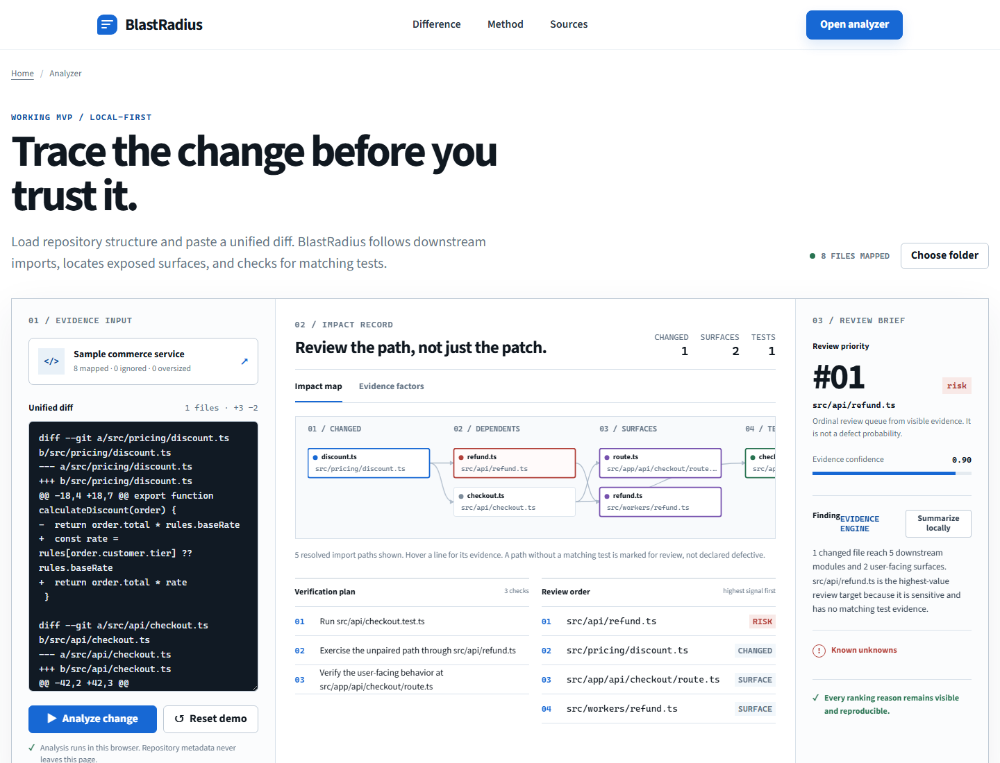

# BlastRadius

[](https://nodejs.org/)
[](LICENSE)

[Live demo](https://ayaanakhan.github.io/blastradius/) · [Evaluation](evaluation/README.md) · [Architecture](docs/architecture.md)

BlastRadius turns a pull request into an explainable review order. It parses the diff, follows reverse imports, identifies exposed surfaces and related tests, and names uncertainty instead of inventing certainty.



## Measured result

The reproducible harness fetched 300 merged pull requests from each of Vite, Flask, and Express. A positive label is a changed file with an inline human review comment, excluding bots and the pull request author.

| Held-out repository | n | Random P@1 | Churn P@1 | Dependents P@1 | BlastRadius P@1 | BlastRadius R@3 |
| --- | ---: | ---: | ---: | ---: | ---: | ---: |
| vitejs/vite | 12 | 46.4% | 66.7% | 75.0% | 75.0% | 58.3% |
| pallets/flask | 2 | 28.8% | 100.0% | 100.0% | 100.0% | 100.0% |
| expressjs/express | 12 | 81.9% | 83.3% | 91.7% | 91.7% | 100.0% |

The result is mixed. BlastRadius improves Precision@1 over churn on Vite and Express, ties the dependents baseline, and loses to churn on Vite Recall@3. Flask is too small for a stable conclusion. [Read the full methodology, MRR, development split, and limits](evaluation/README.md).

## How it works

- A pure TypeScript core emits the versioned `rank-v1` result.
- The web app analyzes bounded folder metadata in a Web Worker. Nothing is uploaded.
- The CLI uses the TypeScript compiler for aliases, barrels, type-only edges, and imported symbols.
- A composite pull request action publishes one sticky, evidence-backed review plan.

Self-analysis of commit `20babdc` ranked `packages/core/src/compiler-adapter.ts` first because it reached three downstream files. It resolved 49 imports, reported zero unresolved imports, and assigned 0.68 evidence confidence. That run also exposed a prose-versus-rank mismatch, fixed in `86e2b20` with a regression test.

## Run

```bash
npm ci
npm run dev
npm run cli -- --base main --head HEAD
npm run check
```

The optional local model rewrites only the brief and never changes graph edges or rank. It uses a loopback Ollama endpoint, requires no paid API, and is unavailable in the hosted build.

## Honest limits

- Review comments are an attention proxy, not defect labels.
- The browser mapper is lighter than the compiler-backed CLI.
- Static analysis misses reflection, dependency injection, and runtime routing.
- Exact filename test matching is association evidence, not coverage proof.
- Historical evaluation excludes reviews without inline comments.

See the [ranking policy](docs/ranking-model.md), [decision record](docs/decisions/0001-deterministic-core.md), and [contribution guide](CONTRIBUTING.md).
