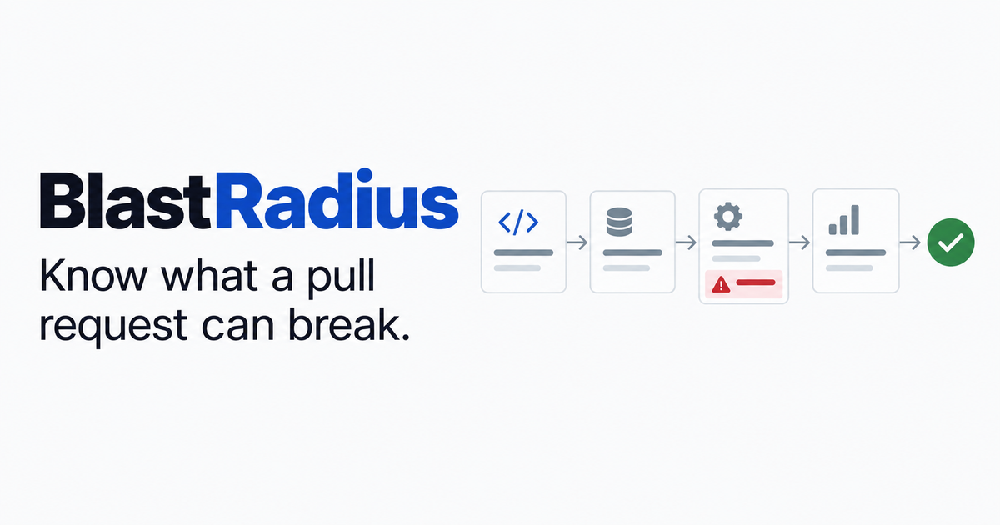
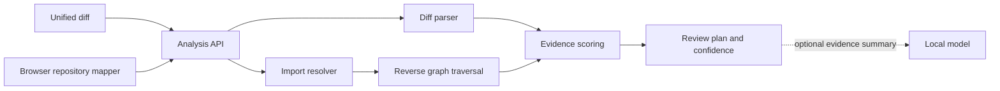

# BlastRadius

[](https://nodejs.org/)
[](LICENSE)

**Explainable pull-request impact analysis for engineers who need to know where review time matters most.**



BlastRadius accepts a unified diff and an optional local repository map, follows reverse imports for up to three hops, finds exposed surfaces and related tests, then produces a prioritized review plan. Every score contribution is visible. Every missing signal is named.

The score measures **review attention**, not defect probability. BlastRadius never claims that a file is broken or vulnerable.

## Why it is different

Many developer tools stop at a generated summary. BlastRadius keeps the reasoning path inspectable:

- **Deterministic analysis:** parsing, graph traversal, matching, scoring, and confidence are ordinary tested code.
- **Evidence before narrative:** an optional local model can summarize results, but it cannot create graph edges or alter the score.
- **Privacy-conscious ingestion:** repository files are read in the browser. The API receives file paths and import metadata, not source contents.
- **Explicit uncertainty:** unresolved imports, dynamic imports, missing repository context, and absent runtime data lower confidence or appear as unknowns.
- **Actionable output:** the result is a review order and verification plan, not another block of prose.

## Product flow

1. Paste a unified Git diff.
2. Optionally select a TypeScript, JavaScript, or Python folder.
3. The browser extracts supported paths, static imports, test markers, and exposed-surface markers.
4. The API parses the diff, resolves imports, and walks the reverse dependency graph.
5. BlastRadius ranks review attention and explains each contribution.
6. The result names the best review target, suggested checks, confidence, and unknowns.

## Engineering highlights

| Concern | Implementation |
| --- | --- |
| Graph analysis | Reverse dependency traversal bounded to three hops |
| Explainability | Per-factor values, contributions, and plain-language evidence |
| Input safety | Request size, file count, path length, and import count limits |
| Graceful degradation | Deterministic output remains available without a local model |
| Privacy | Metadata-only server boundary; source text stays in the browser |
| Performance | Route-level client isolation and no production browser source maps |
| Quality | Eight unit tests, strict TypeScript, linting, production build, and one-command verification |
| Discoverability | Page metadata, canonical links, structured data, sitemap, robots, and llms.txt |

## Architecture



The analyzer is a pure TypeScript module. The route handler validates the transport boundary and optionally calls a local model adapter. The interface renders the returned graph, score factors, verification steps, and uncertainty without hiding the underlying evidence.

Read the [architecture guide](docs/architecture.md), [scoring model](docs/scoring-model.md), and [deterministic-core decision record](docs/decisions/0001-deterministic-core.md) for the deeper engineering rationale.

## Run locally

Requirements: Node.js 22.13 or newer.

```bash
git clone https://github.com/AyaanAKhan/blastradius.git
cd blastradius
npm ci
npm run dev
```

Open `http://localhost:3000`.

### Optional local model

The complete analyzer works without a model or paid API. To add a short evidence summary, run [Ollama](https://docs.ollama.com/quickstart) locally and copy `.env.example` to `.env.local`:

```dotenv
OLLAMA_URL=http://127.0.0.1:11434
OLLAMA_MODEL=qwen2.5:3b
```

If the model is unavailable or times out, the deterministic result is returned unchanged.

## API contract

`POST /api/analyze`

```json
{
  "diff": "diff --git a/src/refund.ts b/src/refund.ts\n...",
  "files": [
    {
      "path": "src/refund.ts",
      "imports": ["./ledger"],
      "isTest": false,
      "isSurface": false
    }
  ]
}
```

The response includes changed files, graph nodes and edges, score factors, confidence, a verification plan, a brief, unknowns, and summary statistics. See [docs/architecture.md](docs/architecture.md) for limits and trust boundaries.

## Verification

Run the complete quality gate:

```bash
npm run check
```

The test fixtures cover:

- unified-diff counting
- reverse-import traversal and the three-hop bound
- surface and test discovery
- score reduction when tests change
- confidence degradation without repository context
- unresolved-import reporting
- configuration-change evidence
- deterministic repeatability

## Repository map

```text
app/                         Next.js routes and analysis endpoint
components/                  Product interface and accessible navigation
lib/analyzer.ts              Pure analysis and scoring engine
lib/site.ts                  Shared metadata configuration
tests/analyzer.test.ts       Deterministic fixtures
docs/                        Architecture, scoring, and decisions
public/                      Product favicon and social card
```

## Honest limitations

- Regex import extraction is an MVP tradeoff. A production parser should use Tree-sitter or language-native compiler APIs.
- Package aliases, barrel exports, reflection, dependency injection, and runtime routing can hide edges.
- Test-name matching is evidence of association, not proof of behavioral coverage.
- Score weights are review policy choices, not a trained defect model.
- Runtime traces, code ownership, and historical incident labels are outside this version.
- Python relative-import support is intentionally basic.

## Roadmap

1. Replace regex extraction with a TypeScript compiler adapter.
2. Import Istanbul coverage and connect tests to executed source files.
3. Add a metadata-only CI artifact for pull requests.
4. Evaluate the top three review targets on labeled merged changes.
5. Add runtime evidence only after static-impact quality is measured.

## Documentation

- [Architecture](docs/architecture.md)
- [Scoring model](docs/scoring-model.md)
- [Contributing](CONTRIBUTING.md)

## License

MIT, see [LICENSE](LICENSE).
