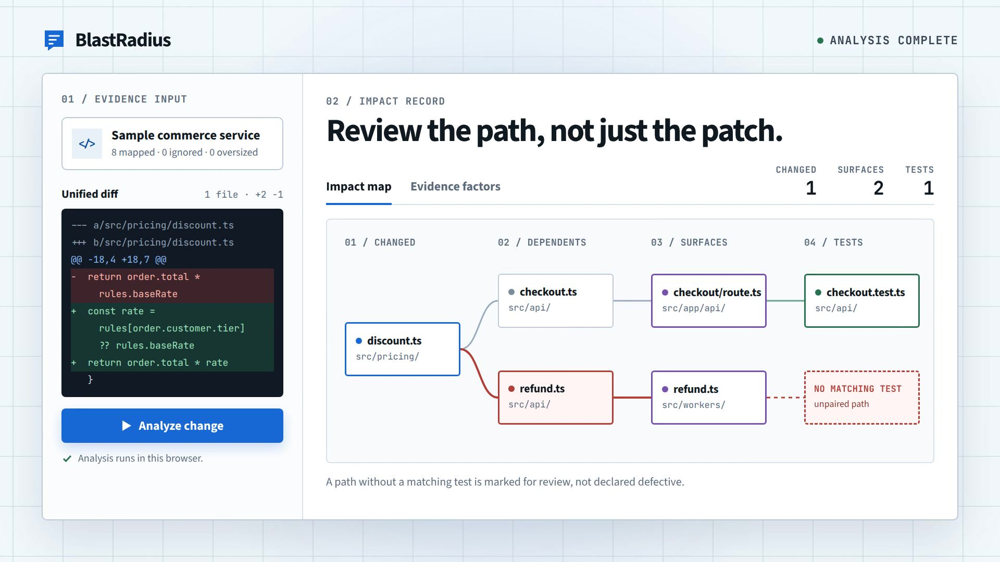

# BlastRadius

[](https://nodejs.org/)
[](LICENSE)

[Live demo](https://ayaanakhan.github.io/blastradius/) · [Evaluation](evaluation/README.md) · [Architecture](docs/architecture.md)

BlastRadius turns a pull request into an explainable review order. It parses the diff, follows reverse imports, identifies exposed surfaces and related tests, and names uncertainty instead of inventing certainty.


## Measured result

The honest result is that dependency reach is useful, but neither published policy beats the graph-only dependents baseline on held-out data. The original hand-written buckets reduced development MRR from 0.832 without buckets to 0.800. rank-v2 removed those buckets and was selected only on the development split, where it reached 0.837 MRR, but it still trails dependents on the pooled held-out split.

| Pooled held-out method | n | Precision@1 | Recall@3 | MRR |
| --- | ---: | ---: | ---: | ---: |
| Random expected value | 26 | 61.5% | 79.3% | 0.755 |
| Churn | 26 | 76.9% | 89.7% | 0.863 |
| Dependents | 26 | 84.6% | 82.0% | 0.892 |
| Published rank-v1 | 26 | 84.6% | 80.8% | 0.884 |
| BlastRadius rank-v2 | 26 | 73.1% | 82.0% | 0.832 |

The paired mean MRR delta for rank-v2 versus dependents is -0.059 with a 95 percent bootstrap interval of [-0.135, -0.002]. That negative result is the roadmap, not something hidden behind a demo. All 121 per-example measurements are committed, and `npm run evaluation:report` reproduces the aggregate tables, 10,000-resample intervals, normalized lift, hard subset, ablation, and Wilcoxon test without network access in about two seconds. [Read the full methodology and limits](evaluation/README.md).

## How it works

- A deterministic TypeScript core emits the versioned `rank-v2` changed-file queue and a separate unchanged-file watchlist.
- The web app analyzes bounded folder metadata in a Web Worker. Nothing is uploaded.
- The CLI combines compiler-backed TypeScript and JavaScript analysis with a tested Python import adapter.
- A prebuilt composite action publishes one sticky, evidence-backed review plan without installing the web application.

The project is deliberately stronger as an engineering artifact than as a product claim: a real workspace split, package exports, configuration validation, Markdown/JSON/SARIF output, content-hash mapping cache, exact ranking tests, enforced coverage, reproducible evaluation, and explicit failure modes.
## Launch video

A 21-second walkthrough of the sample commerce service: a three-line pricing change traced through its dependents to an untested worker, then ranked into a review order.

[](docs/brag.mp4)

## Run

```bash
npm ci
npm run dev
npm run cli -- --base main --head HEAD
npm run evaluation:report
npm run check
```

The optional local model rewrites only the brief and never changes graph edges or rank. It uses a loopback Ollama endpoint, requires no paid API, and is unavailable in the hosted build.

## Honest limits

- Review comments are an attention proxy, not defect labels.
- The browser mapper is lighter than the compiler-backed CLI.
- Static analysis misses reflection, dependency injection, and runtime routing.
- Exact filename test matching is association evidence, not coverage proof.
- Historical evaluation excludes reviews without inline comments.

See the [ranking policy](docs/ranking-model.md), [configuration reference](docs/configuration.md), [mapping benchmarks](docs/benchmarks.md), [architecture](docs/architecture.md), [decision record](docs/decisions/0001-deterministic-core.md), and [contribution guide](CONTRIBUTING.md).
