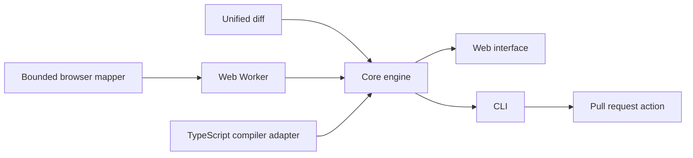

# Architecture

BlastRadius has one deterministic core and three delivery paths.

## Core

`packages/core` parses unified diffs, resolves imports, builds a reverse graph, follows at most three hops, associates tests, and produces the versioned `rank-v1` review queue. It has no network, filesystem, framework, or model dependency.

Compiler metadata can attach a resolved target, value or type-only edge, imported symbols, and barrel re-export evidence. When a diff identifies a changed declaration, consumers that import only unchanged symbols are filtered.

## Browser path

The browser reads a selected folder, excludes generated directories, caps input at 5,000 files and 256 KB per file, and extracts at most 80 imports per file. Analysis runs in a Web Worker. The hosted site has no analysis API, so source and repository metadata stay on the page.

The browser mapper is intentionally lightweight. It understands relative imports, configured aliases, JavaScript side-effect imports, and Python relative depth, but it does not claim compiler precision.

## Automation path

`packages/cli` maps TypeScript and JavaScript through the compiler adapter, reads a git revision range, and prints Markdown or JSON. `action.yml` runs the CLI on a pull request and updates one sticky review-plan comment.

## Optional model

The graph, rank, confidence, and verification plan never depend on generated text. On a loopback development origin, the user may send a bounded evidence summary directly to a local Ollama model. The model may replace only the brief, and the interface labels its source.

## Failure behavior

| Failure | Behavior |
| --- | --- |
| Unparseable diff | Empty result, explicit unknown, confidence 0.20 |
| Empty graph with a nonempty map | Explicit unknown and confidence capped at 0.35 |
| Oversized folder | Bounded subset analyzed and skipped count shown |
| Unresolved import | Unknown reported and confidence reduced |
| Local model unavailable | Deterministic brief remains active |

Golden outputs from public pull requests are checksummed. The evaluation harness checks 900 merged pull requests at their head SHAs and keeps the simpler baselines in the published results.
