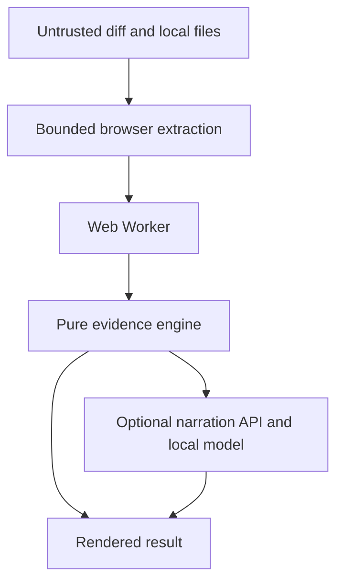

# Architecture

BlastRadius separates evidence collection, deterministic analysis, and optional narration so each part can fail without corrupting the others.

## Components

### Browser repository mapper

The browser reads a user-selected directory and extracts metadata from supported TypeScript, JavaScript, and Python files. It records paths, static import specifiers, test markers, surface markers, and dynamic-import flags. A dedicated Web Worker runs the analysis locally, so neither source contents nor the repository map cross the network.

Limits:

- 5,000 supported files
- 256 KB per file during browser extraction
- 80 import specifiers per file
- 400 characters per path

### Optional narration API

`POST /api/narrate` accepts at most 100 KB of already-computed evidence. It never receives the diff, repository paths, import graph, or source contents. Responses are marked `no-store`.

If `OLLAMA_URL` is configured, the route may request a short local summary after the user explicitly asks for it. A timeout or model error leaves the deterministic result unchanged.

### Analysis engine

The engine performs six steps:

1. Parse changed paths and line counts from the unified diff.
2. Normalize repository paths.
3. Resolve relative static imports against known paths.
4. Build a reverse dependency graph.
5. Traverse downstream dependents for at most three hops.
6. Match exposed surfaces and likely tests, then calculate score and confidence.

The engine is a pure module with no network or filesystem access. The Web Worker keeps graph construction off the main thread and makes the analysis contract reproducible and easy to test.

## Trust boundaries

- Diff text and extracted metadata are untrusted.
- Folder filters and hard caps bound browser work.
- React renders strings without interpreting them as markup.
- The optional narration API receives only a constrained evidence summary after a user action.
- Model output changes only the brief and is labeled by `narrativeSource`.

## Failure behavior

| Failure | Behavior |
| --- | --- |
| Oversized folder | First 5,000 eligible files are mapped and the skipped count is shown |
| Missing repository map | Diff-only result with lower confidence |
| Unresolved import | Reported as an unknown and confidence penalty |
| Local model unavailable | Deterministic brief remains active |

## Scaling path

The current engine is intentionally in-memory and bounded. A production version could move repository mapping into a CI job, store versioned graph artifacts, use compiler-backed parsers, and join coverage or ownership evidence by commit SHA. The API contract can remain stable while those adapters evolve.
